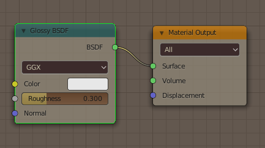

# composition

A composite framework to stylize or edit surface radiance like toon shading while keeping global illumination.
It decomposes an image into effects of each target surface using photon mapping on the surface.

## Algorithm

It first traces suffix sub-path from eye to the target surface and store the hitpoint information.
Hitpoint information contains the throughput along each path as well as other necessary information for photon mapping.
The throughput represents the propagation of the radiance on the hitpoint to surrounding surface.

Then, the radiance on the collected hitpoints are estimated with photon mapping.
Now that we have both surface radiance and its bleeding into other surface.
We can edit the material with any info on the surface including its radiance, and can deliver it along its suffix path.

## Usage

### Run a C++ Program
#### Dependencies
* [glm](https://github.com/g-truc/glm)
* [stb](https://github.com/nothings/stb)/stb_image_write.h

#### Compilation
just compile `main.cpp` and `cmp.cpp` then run it

### Use with Blender
#### Dependencies
* [blender](https://www.blender.org/) (bpy)
* [Boost.Python](https://www.boost.org/doc/libs/1_75_0/libs/python/doc/html/index.html)
* [glm](https://github.com/g-truc/glm)
* [stb](https://github.com/nothings/stb)/stb_image_write.h

#### Compilation
1. Compile `interface.cpp` and `cmp.cpp` with boost python library to generate a shared object which name is `composition.so` for linux or `composition.pyd` for windows.
2. Put it under `./composition/core/`
3. Open blender (from terminal, recommended.)
4. Create a scene and script. (see below)

#### Scene Creation

**Shapes:** You can use any surface models.

**Materials:** Only *Emission*, *Diffuse*, *Glossy*, and *Glass* shaders without input nodes are implemented.
Set one of them singularly for each material.

#### Writing a Script
TBA. see samples in `./scenes`.

##### Scene Description
##### Rendering
##### Remapping

## todo

### soon
* manage rng seed
* use image textures
* photon emission form a mesh
* parallelize hit to radiance conversion
* use matrix for spaces
* switch to range based raycasting
* switch console output method from print to to_string

### future
* represent suffix path distribution with gaussian parameters or something

### pending
* embed necessary info in hitpoints